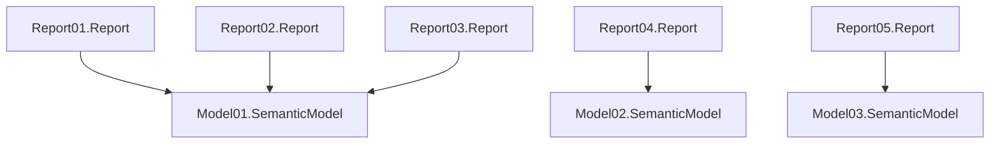

# Power BI Project (PBIP) sample folder - Artefact

This repository showcases a Power BI Project (PBIP) folder structure in the [src folder](./src/).

## GitHub Copilot

You can use [GitHub Copilot](https://code.visualstudio.com/docs/copilot/overview) or [Roo Code](https://docs.roocode.com/) to modify your PBIP files more efficiently—for example, by setting descriptions across all semantic model objects. This project includes a [copilot-instructions.md](./.roo/rules/01-power-bi-rules.md) file that guides Copilot to work more effectively with TMDL files.

## Recommended tools to be installed

- [VS Code](https://code.visualstudio.com/download)
- VS Code Extensions
  - [Roo Code](https://marketplace.visualstudio.com/items?itemName=RooVeterinaryInc.roo-cline)
  - [TMDL](https://marketplace.visualstudio.com/items?itemName=analysis-services.TMDL)
  - [Git Graph](https://marketplace.visualstudio.com/items?itemName=mhutchie.git-graph)

Main External Power BI Tools
- [Tabular Editor](https://docs.tabulareditor.com/te2/Getting-Started.html) - follow the instructions on the website to download and install the tool
- [DAX Studio](https://daxstudio.org/)
